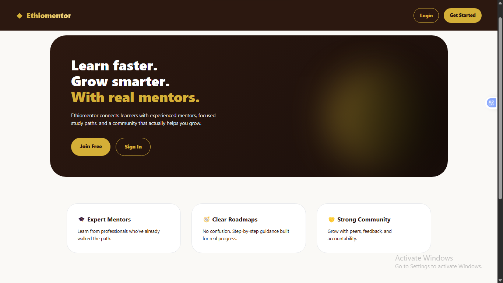
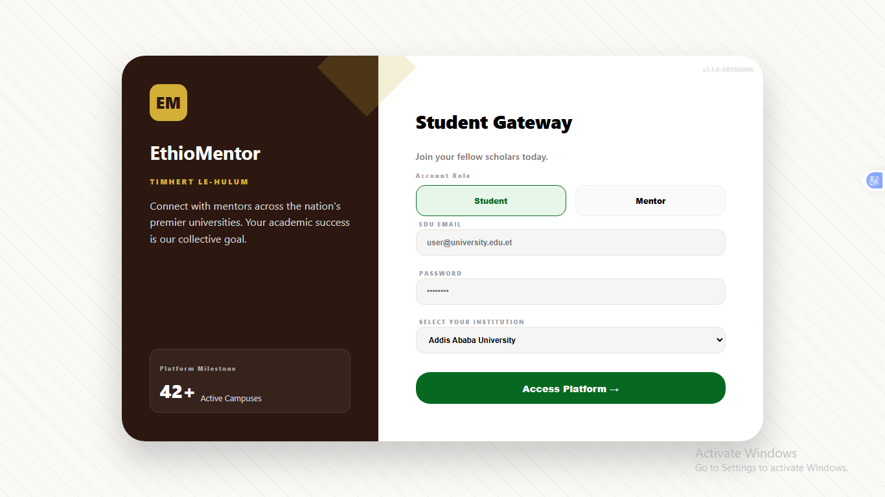
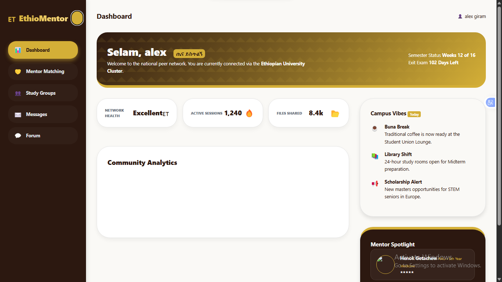
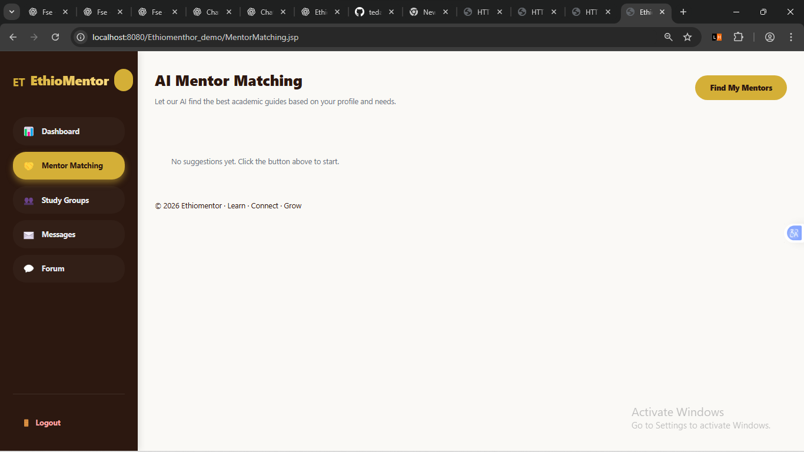
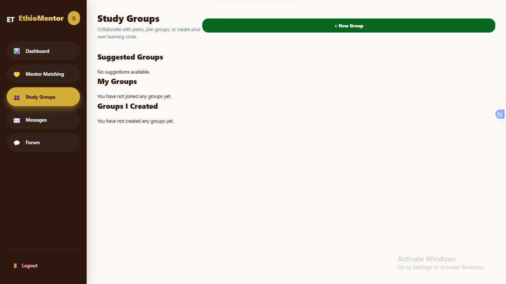
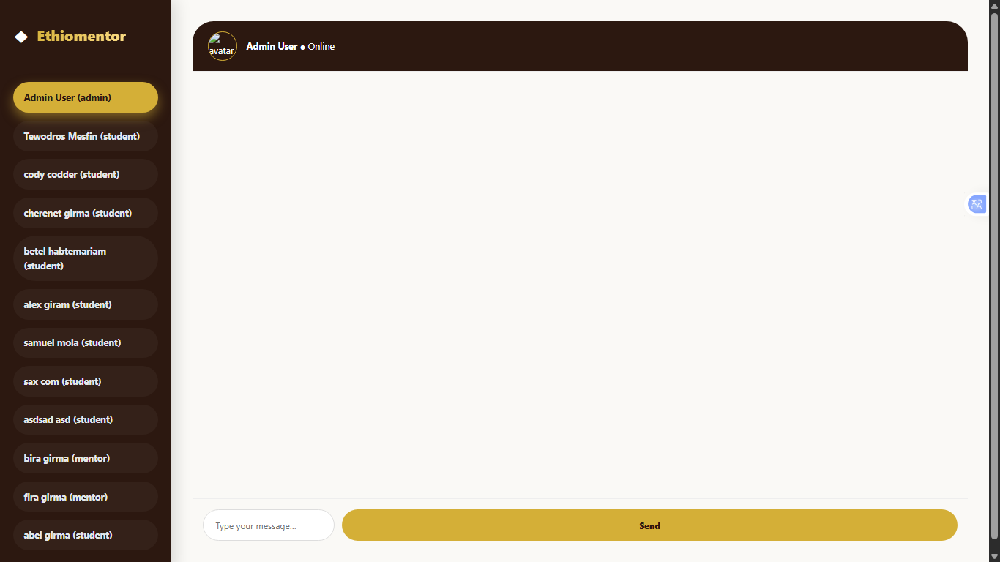

# Ethiomentor 🌟

[](https://github.com/BiraGirma/-EthioMentor)
[]

Ethiomentor is a **peer mentoring platform for Ethiopian university students**, offering **chat 💬**, **study groups 📚**, and **mentor matching 🤝** to support students in academic collaboration and mentorship.

---

## Table of Contents 📑

1. [Project Overview](#project-overview-)
2. [Project Structure](#project-structure-)
3. [Features](#features-)
4. [Technologies Used](#technologies-used-)
5. [Installation & Setup](#installation--setup-)
6. [Screenshots](#screenshots-)
7. [Contributors](#contributors-)
8. [License](#license-)

---

## Project Overview ✨

Ethiomentor connects university students with peers and mentors to enhance academic performance and collaboration. The platform supports:

* **User Registration & Login 🔐** – Secure authentication for students and admins.
* **Dashboard 📊** – Overview of activities, groups, and chats.
* **Mentor Matching 🤝** – Connect mentees with available mentors.
* **Study Groups 📚** – Create, join, and manage study groups.
* **Chat System 💬** – Real-time messaging between users.

The backend is built using **Java Servlets ☕** and **JSP**, with a **PostgreSQL 🐘** database, and the frontend uses HTML, CSS, and JavaScript.

---

## Project Structure 🗂️

```
Ethiomentor/
├── pom.xml
└── src/
    └── main/
        ├── java/
        │   └── com/ethiomentor/
        │       ├── config/
        │       │   ├── DBConfig.java
        │       │   └── DBInit.java
        │       ├── controller/
        │       │   ├── AdminServlet.java
        │       │   ├── AuthServlet.java
        │       │   ├── ChatWebSocket.java
        │       │   ├── CreateStudyGroupServlet.java
        │       │   ├── DashboardServlet.java
        │       │   ├── GroupServlet.java
        │       │   ├── JoinStudyGroupServlet.java
        │       │   ├── LogoutServlet.java
        │       │   ├── MentorMatchingServlet.java
        │       │   ├── MessageServlet.java
        │       │   ├── LoadMessagesServlet.java
        │       │   ├── MentorDashboardServlet.java
        │       │   ├── RegisterServlet.java
        │       │   ├── StartupServlet.java
        │       │   ├── StudyGroupServlet.java
        │       │   └── UserServlet.java
        │       ├── dao/
        │       │   ├── ChatDAO.java
        │       │   ├── ConversationDAO.java
        │       │   ├── GroupDAO.java
        │       │   ├── MentorDAO.java
        │       │   ├── MessageDAO.java
        │       │   ├── MessageStatusDAO.java
        │       │   ├── StudyGroupDAO.java
        │       │   └── UserDAO.java
        │       ├── model/
        │       │   ├── ChatMessage.java
        │       │   ├── ChatRoom.java
        │       │   ├── Conversation.java
        │       │   ├── MenteeProfile.java
        │       │   ├── MentorProfile.java
        │       │   ├── MessageStatus.java
        │       │   ├── StudyGroup.java
        │       │   └── User.java
        │       ├── service/
        │       │   ├── AdminService.java
        │       │   ├── AuthService.java
        │       │   ├── ChatService.java
        │       │   ├── MentorService.java
        │       │   └── UserService.java
        │       └── util/
        │           ├── JsonUtil.java
        │           └── PasswordUtil.java
        ├── resources/
        │   └── application.properties (optional)
        └── webapp/
            ├── META-INF/
            │   └── MANIFEST.MF
            ├── WEB-INF/
            │   ├── web.xml
            │   ├── jsp/
            │   │   └── includes/
            │   │       ├── header.jsp
            │   │       ├── footer.jsp
            │   │       └── sidebar.jsp
            │   └── lib/
            │       ├── json-20230618.jar
            │       ├── jstl-1.2.jar
            │       └── postgresql-42.7.8.jar
            ├── css/
            │   ├── chat.css
            │   ├── dashboard.css
            │   ├── global.css
            │   ├── landing.css
            │   ├── login.css
            │   ├── mentormatching.css
            │   ├── register.css
            │   ├── sidebar.css
            │   └── studygroups.css
            ├── js/
            │   ├── chat.js
            │   ├── landing.js
            │   ├── login.js
            │   ├── studygroups.js
            │   └── admin.js
            ├── index.jsp
            ├── login.jsp
            ├── register.jsp
            ├── dashboard.jsp
            ├── chat.jsp
            ├── MentorMatching.jsp
            ├── mentorDashboard.jsp
            ├── admin.jsp
            └── studygroups.jsp
```

---

## Features 🌟

* Role-based authentication (Admin, Mentor, Mentee) 🔐
* Real-time chat using WebSockets 💬
* Mentor-mentee matching system 🤝
* Study group creation and management 📚
* Dashboard with activity overview 📊
* Secure password handling and session management 🔒

---

## Technologies Used 🛠️

* **Backend:** Java Servlets ☕, JSP 📄
* **Frontend:** HTML 🌐, CSS 🎨, JavaScript ⚡
* **Database:** PostgreSQL 🐘
* **Server:** Apache Tomcat 9 🖥️
* **Libraries:** JSON 📦, JSTL 📚

---

## Installation & Setup ⚙️

### Project Setup Guide (Eclipse + JDK 18 + Apache Tomcat)

This project is a **Java Web Application** developed using **Eclipse IDE**, **JDK 18**, and **Apache Tomcat**. Follow the steps below **exactly** to ensure the project runs correctly.

---

### 1. Prerequisites

Ensure the following are installed:

* Java Development Kit (JDK) 18
* Eclipse IDE for Enterprise Java and Web Developers
* Apache Tomcat 9.0.x
* Git

---

### 2. Install JDK 18

Verify installation:

```bash
java --version
```

---

### 3. Install Eclipse

Download **Eclipse IDE for Enterprise Java and Web Developers** (not plain Java).

---

### 4. Configure Eclipse to Use JDK 18

`Window → Preferences → Java → Installed JREs` → Add JDK 18 → Set as default.

---

### 5. Install and Configure Tomcat 10.1

Add Tomcat 9.0.*  to Eclipse via the **Servers** view.

---

### 6. Clone the Project

```bash
git clone https://github.com/BiraGirma/-EthioMentor.git
```

Import as an **Existing Eclipse Project**.

---

### 7. Fix Project Configuration

* Enable **Project Facets** (Java 18, Dynamic Web Module 4.0)
* Set **Target Runtime** to Tomcat 9.0.*
* Ensure **Java Build Path** uses JDK 18

---

### 8. Run the Project

Run the project on **Tomcat 9.0.* ** using **Run on Server**.

---

### 9. Common Mistakes

* Using JRE instead of JDK
* Using Tomcat 10/11
* Missing Project Facets

---

### 10. Instructor Execution Steps

1. Install JDK 18
2. Install Eclipse Enterprise
3. Install Tomcat 9.0
4. Import project
5. Fix facets if prompted
6. Run on server

---

## 🔐 Admin Panel Screenshots

| Admin Dashboard                                      | 
| ---------------------------------------------------- | 
|  | 

---

## Screenshots 📸

| Landing Page                   | Login Page                 | Sign Up Page                 |
| ------------------------------ | -------------------------- | ---------------------------- |
|  |  |  |

| Dashboard                          | Mentor Matching                              | Study Groups                         | Chat / Messages          |
| ---------------------------------- | -------------------------------------------- | ------------------------------------ | ------------------------ |
|  |  |  |  |


---

## Contributors 👥

This project was developed as a **group project for educational purposes** by:

* [Bira Girma](https://github.com/BiraGirma)  UGR/34107/16
* [Biniyam Lema](https://github.com/ben-on-tech) UGR/34018/16
* [Hanif Esmail](https://github.com/hanifo) UGR/30629/15
* [Kalkidan Birhane](https://github.com/pro-kal) UGR/34711/16
* [Tewodros Mesfin](https://github.com/tedacodder) UGR/35497/16

---

## License 📖

This project is for **educational purposes only**.

---

## GitHub Repository 🔗

[https://github.com/BiraGirma/-EthioMentor](https://github.com/BiraGirma/-EthioMentor)
